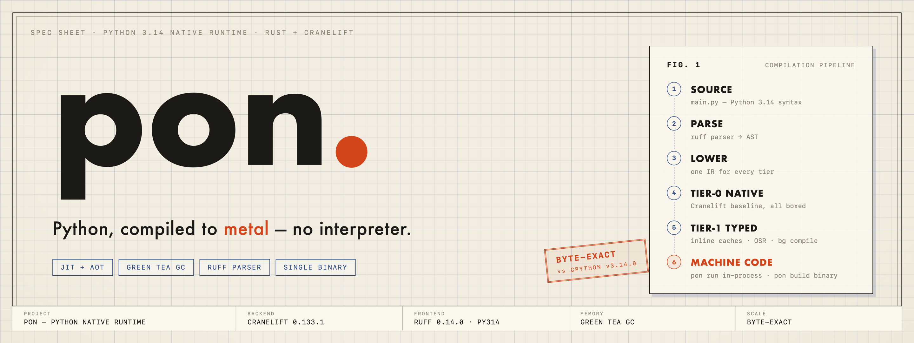
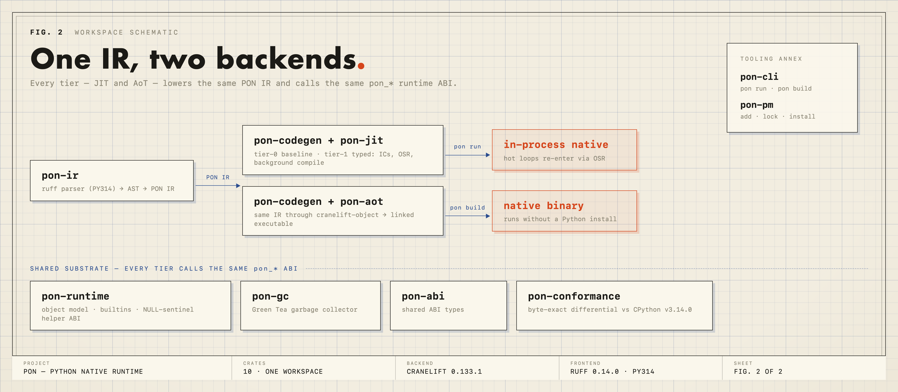

<p align="center">
  
</p>

# pon

`pon` is a JIT & AoT native compiler and runtime for Python 3.14, written in Rust. There is no interpreter and no bytecode: every module is parsed with the ruff parser, lowered to one shared IR, and compiled to machine code through Cranelift — either just-in-time inside the process (`pon run`) or ahead-of-time into a standalone native executable (`pon build`). Memory is managed by a Green Tea garbage collector instead of reference counting, and correctness is enforced by a byte-exact differential harness against CPython v3.14.0.

The end goal is the bun/v8 of Python: a runtime that passes the CPython test suite, runs a multi-tier JIT well past CPython, ships single-binary executables, and includes batteries (package manager, tooling) out of the box. The project is under heavy active development — see [Status](#status) for what is true today versus where it is going.

## Quickstart

```sh
# JIT: parse → IR → Cranelift → run, in-process
printf 'def add(a, b):\n    return a + b\n\nprint("hello, world")\nprint(add(2, 3))\n' > hello.py
cargo run -p pon-cli -- run hello.py

# AoT: same IR through cranelift-object, linked into a native executable
cargo run -p pon-cli -- build hello.py -o hello
./hello
```

Both paths print the same bytes CPython would. That property is not aspirational — it is the exit gate of the conformance suite (see [Conformance](#conformance--testing)).

```
usage: pon run <file>
       pon build <file> -o <out> [--allow-dynamic] [--opt] [--target <triple>]
```

`pon repl` is not implemented yet.

## Architecture

<p align="center">
  
</p>

One IR, two backends, one runtime ABI. Every tier — baseline JIT, optimizing JIT, and AoT — lowers the same IR and calls the same `pon_*` helper functions:

```
source.py
   │ ruff parser (pinned 0.14.0, PythonVersion::PY314)
AST ──> PON IR (pon-ir, one IR for every tier)
   │
   ├── pon run:   pon-codegen ──> cranelift-jit ──> native code in process
   │                 tier-0 baseline (all boxed)
   │                 tier-1 typed: inline caches, OSR, background compile
   │
   └── pon build: pon-codegen ──> cranelift-object ──> object file ──> linked executable
   │
pon-runtime  (object model, builtins, NULL-sentinel pon_* ABI)
pon-gc       (Green Tea garbage collector)
```

**Object model:** CPython's heap object layout minus the refcount header. Errors cross the ABI as NULL sentinels, not unwinding. Integers are arbitrary-precision (`num-bigint` behind `PyLong`); a tagged small-int fast path is landing in the typed tier.

**Tiering:** tier-0 compiles everything boxed with no type feedback and is the correctness baseline (`PON_TIER0_ONLY=1` forces it). Runtime helpers feed `FeedbackCell` type profiles from the first execution; hot functions recompile on a background thread and running loops enter the optimized code via on-stack replacement.

**GC:** the Green Tea collector owns all Python objects. Tier-0 uses conservative stack scanning with a register-flush trampoline at safepoints; the typed tier upgrades to precise Cranelift user stack maps.

## Workspace

| Crate | Role |
| --- | --- |
| `pon-ir` | ruff-based frontend: parse Python 3.14, lower to the shared PON IR |
| `pon-codegen` | IR → Cranelift CLIF, shared by every backend and tier |
| `pon-jit` | in-process compilation, tiering, inline caches, OSR, background compile |
| `pon-aot` | `cranelift-object` backend: object files and linked native executables |
| `pon-runtime` | object model, builtins, stdlib native modules, the `pon_*` helper ABI |
| `pon-gc` | Green Tea garbage collector |
| `pon-abi` | ABI types shared between codegen and runtime |
| `pon-cli` | `pon run` / `pon build` entry points (library-first, reused by `pon-pm`) |
| `pon-pm` | package manager: PyPI index client, resolver, wheel/sdist install |
| `pon-conformance` | differential conformance suites, fuzzing, benchmarks, floor ratchets |

All dependencies are declared once in the root `Cargo.toml` under `[workspace.dependencies]`; member crates only inherit (see [`AGENTS.md`](AGENTS.md)).

## Conformance & testing

The correctness contract is differential: a corpus module passes only if `pon` produces **byte-identical output** to CPython v3.14.0 (`TZ=UTC`, `PYTHONHASHSEED=0`). Passing sets are ratcheted into committed floor files, and CI fails on any regression below the floor.

| Suite | What it measures | Committed floor |
| --- | --- | --- |
| `cpython` | corpus modules, JIT, byte-exact vs CPython 3.14 | 112 modules ([`conformance-floor.json`](conformance-floor.json)) |
| `cpython-aot-subset` | same corpus compiled AoT and executed as native binaries | 108 modules ([`aot-parity-floor.json`](aot-parity-floor.json)) |
| `cpython-full` | CPython's own test suite (`Lib/test`), run under pon | being brought up ([`conformance-full-floor.json`](conformance-full-floor.json)) |
| `fuzz` | differential fuzzing vs CPython; must stay at zero divergences | — |
| `ft-stress` | free-threading stress (`--features free-threading`, experimental) | — |

The standing gate is `scripts/gate.sh`; only its output counts as a gate claim:

```sh
bash scripts/gate.sh fast    # build + workspace tests + conformance floor + AoT floor
bash scripts/gate.sh full    # + free-threading tests, ft-stress, bench, tier0-only diff, fuzz

# Individual meters
cargo run -q -p pon-conformance -- --suite cpython --check-floor
cargo run -q -p pon-conformance -- --mode aot --suite cpython-aot-subset --check-floor
cargo run -q -p pon-conformance -- --suite cpython --modules <file.py>      # one module, differential
cargo run -q -p pon-conformance -- --suite fuzz --seed 42 --count 200 --jobs 8
```

Corpus files are immutable once landed: new coverage is a new module, verified byte-identical against `python3.14` before it enters the manifest. Divergences that are CPython's problem (not pon's) are recorded in [`pon-conformance/divergence-ledger.toml`](pon-conformance/divergence-ledger.toml) rather than papered over.

## Package manager

`pon-pm` is a uv-style package manager built on `pubgrub` resolution and the standard `pyproject.toml`, targeting the PyPI simple index, wheels, sdists, editable installs, and VCS requirements. It delegates script execution to the same `pon-cli` library entry points so `pon-pm run` behaves exactly like `pon run` with managed import roots. It is under active development and not yet integrated into the runtime gates.

```
pon-pm init | add | remove | install | lock | run | list | freeze | show | download | check | cache | env
```

## Pinned toolchain

These pins are settled workspace-wide and enforced by `Cargo.lock` / `rust-toolchain.toml`; do not drift them casually.

| Component | Pin |
| --- | --- |
| Toolchain | `nightly-2026-04-29` (`rust-toolchain.toml`) |
| MSRV | `rust-version = "1.94.0"`, edition 2024 |
| Parser | ruff git tag `0.14.0`, `PythonVersion::PY314` |
| Backend | all `cranelift-*` crates `=0.133.1`, lockstep |
| Bignum | `num-bigint 0.4.6` behind `PyLong` |
| CLIF flags | `preserve_frame_pointers=true`; `is_pic=false` JIT / `is_pic=true` AoT |
| Reference | CPython v3.14.0, pinned in `pon-conformance/vendor/cpython-3.14/REVISION` |

## Status

What is verified today (all behind ratcheted, CI-checked floors):

- `pon run` and `pon build` work end to end; the quickstart above is a smoke-tested example.
- 112 differential corpus modules byte-identical to CPython 3.14 under the JIT; 108 of them also pass compiled AoT.
- The perf substrate is in place: background compilation, OSR, inline caches, type feedback.

What is explicitly **not** done yet — this is the active roadmap, in order:

1. **CPython test suite** (`cpython-full`): the standing grind; failures are clustered and burned down per wave.
2. **Stdlib build-out**: `_io`/`os`, `math`/`struct`/`random`, `collections`/`itertools`/`json`, `datetime`, `importlib` parity — each lands as a native module plus a differential corpus module.
3. **Performance ratchets**: tagged small-int flip, TLAB allocation, dict fast paths, float unboxing, call/attribute specialization, generator tiering — toward the ≥5× CPython geomean target (numerics ≥20×).
4. **AoT parity growth** toward the full corpus, plus single-binary product polish.
5. **Free-threading** is feature-gated (`--features free-threading`) and experimental.

Known gaps at the language level are burned down through the ratcheted floors above — the committed floor files, not this README, are the authoritative compatibility baseline.
